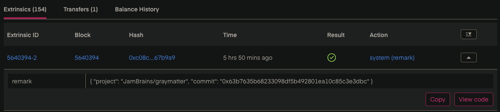
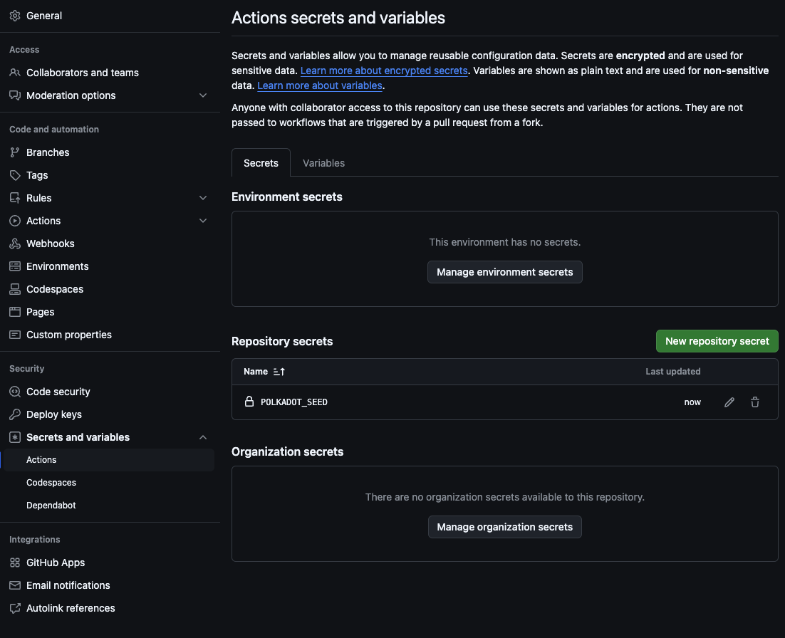

# Remark Commit

CLI to remark commits on-chain to timestamp them in the historical data of Polkadot. It remarks a
string containing the team, project name and commit hash. You can see it in action for the
[1jam](https://collectives-polkadot.subscan.io/account/1jamyjYe97qPPtdeYVcUosPwc2Bv1Y6zNEMtzPW8a2z2abN) account:



## Usage

Install it via cargo:

```sh
cargo install remark-commit --locked
```

...and run:

```sh
remark-commit \
    --seed "//Alice" \
	--org "JamBrains" \
	--repo "graymatter" \
	--commit "93916fb33655de9cb0eb4882e7e2036dbd4c32b9"
```

## GitHub CI

Find a full GitHub CI example that you can copy&paste to your repo in
[remark.yml](./.github/workflows/remark.yml). The core part is this:

```yaml
- name: Remark Commit
  run: |
    cargo install remark-commit --locked -q
    
    SEED="${{ secrets.POLKADOT_SEED }}" \
    remark-commit \
    --org "JamBrains" \
    --repo "remark-commit" \
    --commit "${{ github.sha }}"
```

Ensure that you add a secret key or other seed as `POLKADOT_SEED` secret to your repo. You can use
[subkey](https://crates.io/crates/subkey) to locally generate a secret.



## Key Derivation

Note that this is using Substrate Key derivation for ED25519. Advised approach to configuring a new
key, mnenonic or URI is to dry-run the tool once to check that the output public key is what you
expect. Polkadot supports multiple crypto schemata and different wallets use not only different
crypto schemata but also different key-expansion schemata.

Generate a mnemonic or secret key with (ie with `subkey generate`), using `//Alice` as example here:
```pre
remark-commit --rpc ws://127.0.0.1:8000 --seed "//Alice" --org "JamBrains" --repo "graymatter" -c "1fa22191b7298daf4a5045451f8b2e012c036420"
Sending remark extrinsic from 5GrwvaEF5zXb26Fz9rcQpDWS57CtERHpNehXCPcNoHGKutQY to ws://127.0.0.1:8000
```

Now you know that it will always use `5GrwvaEF5zXb26Fz9rcQpDWS57CtERHpNehXCPcNoHGKutQY` and you can
fund that with 1 DOT.

## Why

Teams spiring to claim the [JAM Prize](https://jam.web3.foundation/) are possibly in need of proving
that their work happened in a specific time span. This project allows teams to timestamp their
commits with the help of the Polkadot blockchain.

## License

Licensed under the [GPLv3](./LICENSE).
